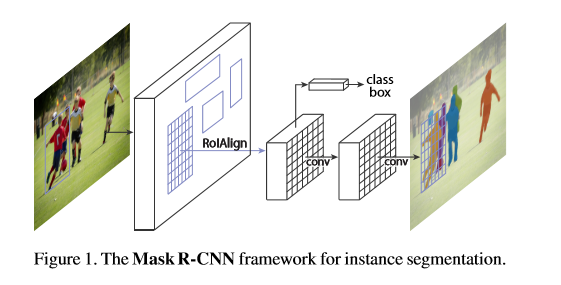
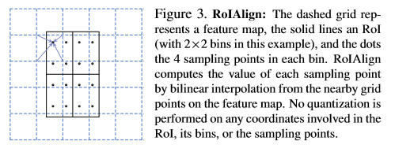

# Mask R-CNN

code: https://github.com/ facebookresearch/Detectron

ICCV 2017

## Motivation

1. 特征图与原始图像上的(Region of Interest, RoI)的不对齐问题
2. 分离掩模预测与分类预测
3. 掩模表示问题

## Method

Mask R-CNN汲取Faster R-CNN检测模型以及全卷积神经网络（Fully Convolutional Network）分割模型优点，有如下的结构：

有两个分支：

1. 原始的Faster R-CNN结构，对候选区域进行分类和位置坐标回归
2. 利用全卷积神经网络预测每个RoI的分割掩模

### Key Points

#### 1. RoIAlign

虚线表示特征图，实线表示RoI，将RoI划分成2*2的单元格。单元格内的采样点数是4，再均分成四个小方格，每个方格中兴是采样点，采样点的坐标是浮点数，对采样点像素进行双线性插值，就可得到像素点的值。对每个单元格内的四个采样点进行maxpooling，就可以得到最终的RoIAlign结果。

量化引起ROI与提取到的特征无法对准，不会分类任务造成过大影响，但会对回归任务产生比较大的影响

RoIAlign可将提取到的特征与输入图像对齐，即不对RoI的边界做量化，使用双线性插值代替最近邻插值的方式实现。

#### 2.对每个类别分别预测二值掩模

好处：无类间竞争，每个二值掩模的类别依靠网络的RoI分类分支给出的分类预测结果

分割任务中的softmax变为sigmoid输出

#### 3.掩模表示

一个掩模编码一个输入对象的空间布局信息。

补充：

##### 双线性插值

在两个方向上进行线性插值​                                                                                                                                                                                                                                                                                                                                                                                                                                                                                                                                                                                                                                                                                                                                                           

##### RoIpooling

1. 拥有一张特征图
2. 从特征图上得到RoI
3. 划分2*2的网格
4. 每个网络进行maxpooling输出

