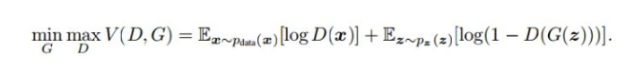
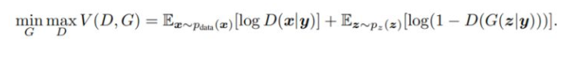

# GAN

由生成网络和判别网络组成，生成网络的目标是尽量生成真实的图片去欺骗判别网络，判别网络的目标是尽量把生成网络中生成的图片和真实图片分别开来，这样，就构成了一个动态“博弈”的过程。

## 损失函数

## GAN常见问题

生成器梯度消失：生成器定义的分布和数据的分布是高危空间的低维流形

模式坍塌：反复生成一些相近或相同的图片

生成器和判别器的loss无法指示训练结果

## 训练技巧

标签平滑

TTUR（Two Time-Scale Updata Rule)使用一个超参数控制生成器和判别器使用不同的学习率，一般生成器选择更低的学习率

谱归一化：

## WGAN

目标函数由原来的二分类变成了为样本打分，训练评分器，也是计算生成器分布和真实分布的W距离，给定评分器，训练生成器也是在缩小这个距离

作用：

解决了GAN训练不稳定的问题，不再需要小心地平衡生成器和判别器的训练程度

解决了模式坍塌的问题，确保了生成样本的多样性

训练过程中存在交叉熵，准确率这样的指标来指示训练进程，数值越小代表GAN训练得越好，即生成器生成的图片质量越高

## Conditional GAN(cGAN)

可以实现各种的图像对图像的翻译任务，其目标函数是把原始GAN目标函数中的概率改为条件概率

## CycleGAN

需要非成对的数据进行训练

使用原始GAN的做法，那么模型会倾向于把domain X中的所有样本都映射为domain Y中的同一张图

CycleGAN的模型结构如下：总共有两个Cycle,一个是将domain x转到domain Y，然后再转回domain X ;另一个是从domain Y 转到domain X ,然后在转回domain Y 。两个循环各有一个循环一致性损失。将X的图片转换到Y中的图片后，必须能转换回来，这样就可以避免模型把所有X中的图片都转换为Y中的同一张图片。

