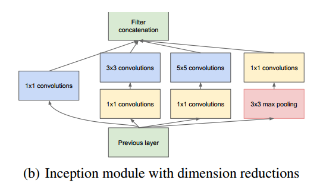
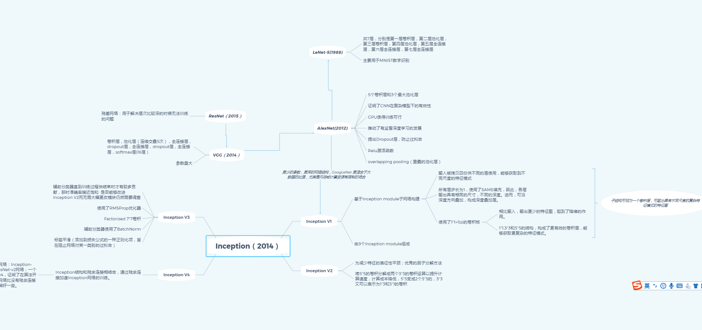

# Inception V1, V2, V3, V4

## Inception V1

Inception出现之前，CNN中卷积层被堆叠得越来越多，网络越来越深，以此达到更好的性能。

Inception v1使用了Inception模块，拓展了网络的宽度，即对输入并行地执行多个卷积运算或池化操作，各个操作输出拼接为更多通道的特征图。具体操作是将1*1,3*3,5*5的卷积层和3*3的池化层分支输出堆在一起，一方面可以增加网络的宽度，另一方面增加了网络对尺度的适应性，顺便对某些分支进行了1*1的卷积操作，减少每个分支的通道数，节省了计算量，结构如下图：

特点：

1. 低层使用传统加深网络深度的方式，高层用Inception模块叠加
2. 用Global Average Pooling替换传统的全连接层，减少参数量
3. 为了解决浅层梯度弥散的问题，添加辅助loss，在训练的时候以一定的权重参与梯度传递，测试时无需加

## Inception V2

在Inception V1的基础上，有以下改变：

1. 增加了BN层，减少了Internal Covariate Shift，使得每一层的输出都规范化到了一个N（0,1）的高斯
2. 学习VGG用2个3*3的卷积层替代Inception模块中的5*5,一方面降低了参数数量，也加速了计算

## Inception V3

改变：

1. 分解，将7*7分解成两个一维卷积（1*7和7*1），将3*3分解成（1*3和3*1），一方面可以加速运算，加深网络，增加网络非线性
2. 网络输入从224*224变为299*299
3. 增加了RMSprop(参数优化方式)
4. label smoothing
5. 第一个7*7的卷积层替换成了3个3*3的卷积
6. 在辅助层的全连接层后面进行了BN操作

## Inception V4  Inception-ResNet V1 Inception-ResNet V2

结合残差网络单元进行改进，加速训练，性能提升

参考：

1. <https://blog.csdn.net/yuanchheneducn/article/details/53045551>
2. <https://zhuanlan.zhihu.com/p/37505777>
3. Going deeper with convolutions
4. Rethinking the Inception Architecture for Computer Vision
5. Inception-v4, Inception-ResNet and the Impact of Residual Connections on Learning

网络发展：

