# Anchor-based && Anchor-free

## CornerNet : Detecting Objects as Paired Keypoints

### Motivation

1. 通过关键点检测目标
2. Corner pooling,可有效定位边角

### Method

CornerNet直接预测目标边界框的左上角和右下角的一对定点，使用单一卷积模型生成热点图的连接矢量。

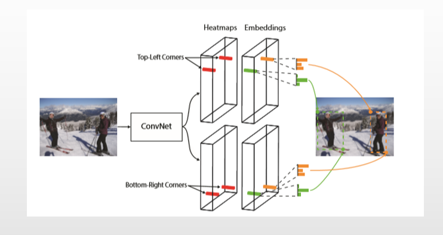

#### Corner pooling 可用于定位边角

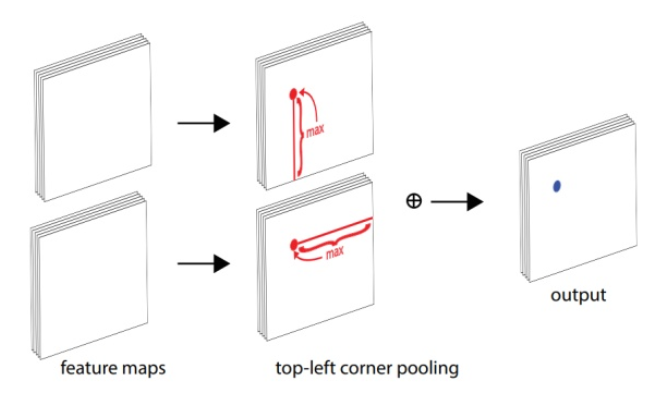

#### 模型架构

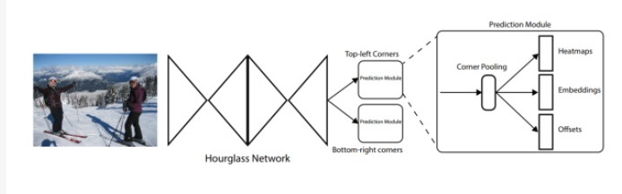

#### 损失函数

##### 分类损失函数

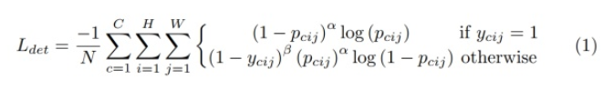

##### 回归损失函数

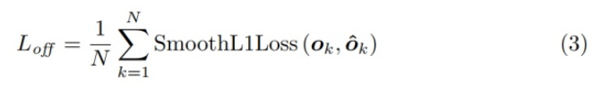

#### 分离边角

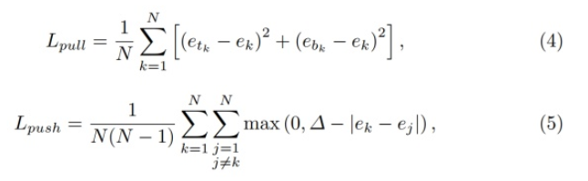

### Conclusion

1. 无需设置anchor
2. Corner pooling 用于提取热点图，嵌入向量（使得相同目标的两个顶点的距离最短），偏移（用于生产更紧密的边界定位框）

## Feature Selection Anchor-Free Module for Single-Shot Object Detection (FSAF)

### Motivation

1. 如何自动学习合适的特征图做预测？

   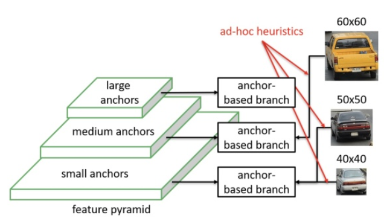

### Method

以RetinaNet为主要结构，添加一个FSAF分支和原来的分类，回归分支并行，在不改变原有的基础上实现完全的端对端训练，框架如下图：

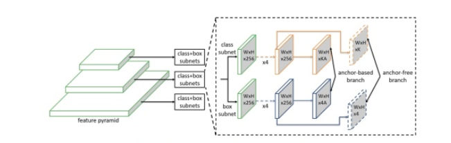

### Ground-truth 和 loss的设计

分类分支是Focal loss

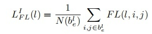

回归分支是Iou loss

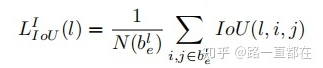

### 在线特征选择

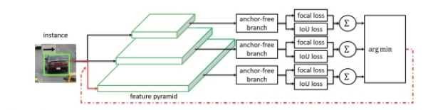

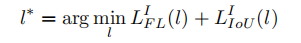

### Conclusion

1. 动态选择特征层进行目标的检测输出
2. 同时使用anchor-based和anchor-free分支

## CenterNet

### Motivation

1. 直接检测目标的中心点和大小

### Method

网络输出3个预测值，80个类，2个预测的中心点坐标，2个中心点偏置

损失函数：

