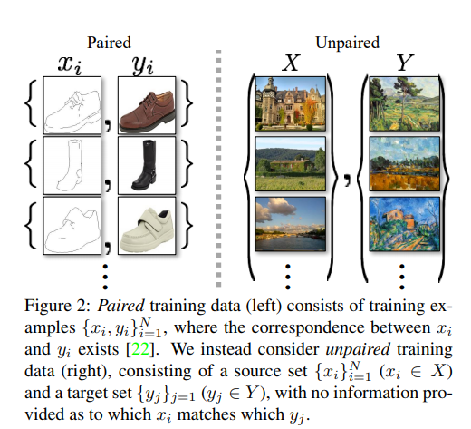
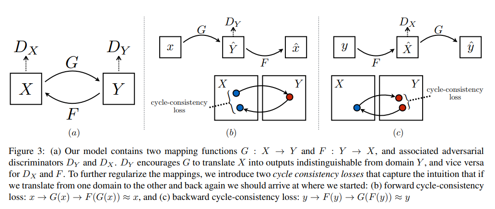
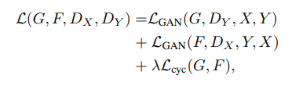

CycleGAN

## 解决问题

面向两个domain数据，实现他们之间的数据迁移，如两类图像风格之间的转变

## 网络模型

(a)包含两个映射函数，G：X->Y ，F：Y->X，还有相应的判别器DY和DX. 

(b)包含循环一致性损失函数，使得X->Y->X

(c)包含循环一致性损失函数，使得Y->X->Y

两种类型的目标：

对抗性损失用于匹配生成图片的分布

循环一致性损失用于防止学得的G和F互相矛盾

目标损失函数：

## 评价指标

AMT perceptual studies 亚马逊土耳其机器人感知学习

FCN score 

语义分割指标：每个像素点的准确率，每个类别的准确率，类IOU（本文使用）

