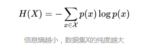
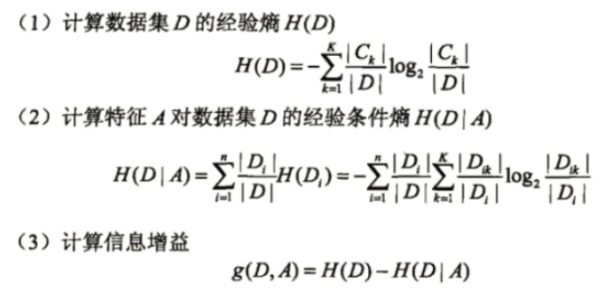
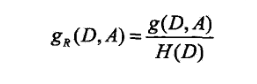
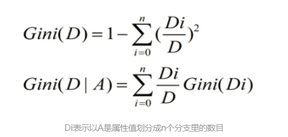
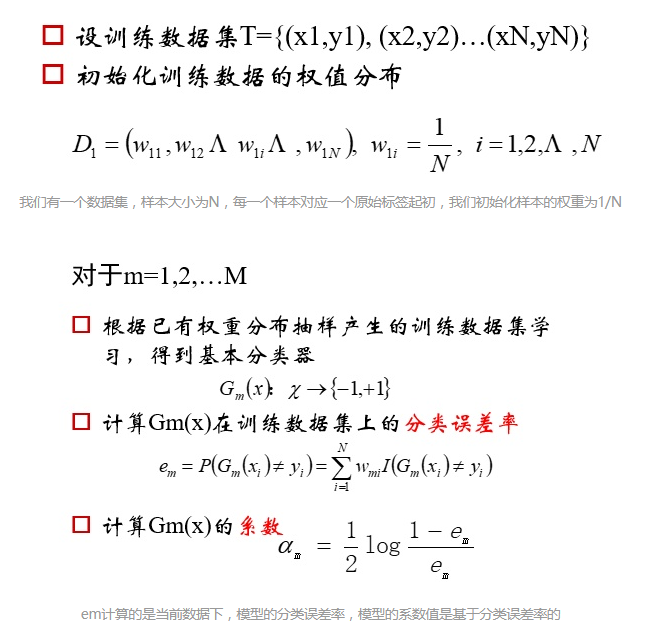
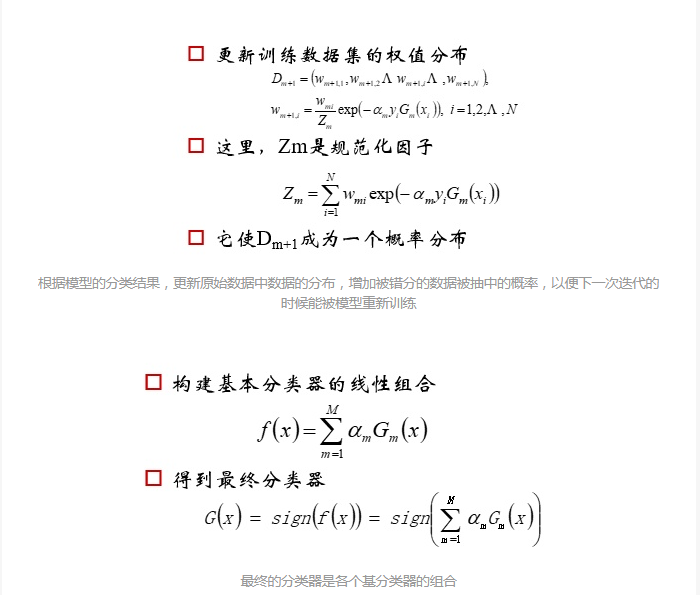

# 集成学习

通过构建多个机器学习器完成学习任务，可用于分类，回归，特征选取，异常点检测集成。

## 概述

解决如何得到若干个个体学习器以及如何选择一种结合策略，将这些个体学习器集合成一个强学习器。

### 个体学习器

异质学习器：不同种个体学习器。

同质学习器：都是同一种个体学习器，应用广泛，通常指决策树和神经网络，根据个体学习器之间存在依赖关系程度，串行或并行生成。

串行生成的代表算法：boosting(依赖关系强)

并行生成的代表算法：bagging和随机森林(依赖关系弱)

## boosting

首先从训练集用初始权重训练出一个弱学习器，根据弱学习的学习误差率的表现来更新训练样本的权重，使得之前弱学习器学习误差率高的训练样本点的权重变高，误差率高的点在后面的弱学习器中得到更多的重视，基于调整权重后的训练集来训练弱学习器，如此重复进行，直到弱学习器达到事先指定的数目，最终将这几个弱学习器通过集合策略进行整合，得到最终的强学习器

代表算法：AdaBoost boosting tree(梯度提升树)

## bagging

每个学习器的训练集通过随机采样得到，分别得到T个采样集，对T个采样集，可以分别独立的训练出T个弱学习器，再通过集合策略得到最终的强学习器。

#### 决策树

决策树是一个有监督的分类模型，它的原理是选择一个能带来最大信息增益的特征值进行树的分割，直到到达结束条件或者叶子结点纯度到达一定阈值。

按照分割指标和分割方法

（1）ID3：以信息增益为准则来选择最优划分属性

（2）C4.5：以信息增益比为准则选择最优划分属性

（3）CART：以基尼系数为准则选择最优划分属性，可以用于分类和回归

Adaboost（Adaptive Boosting)算法

