Adaptive Period Embedding for Representing Oriented Objects in Aerial Images

2019-6-25

## Motivation

1.计算目标的角度是一项具有挑战的任务

2.之前一些的目标检测器直接回归目标的偏移角度，方法复杂，性能受限

3.本文提出一种oriented目标的angular periodicity（角周期性）方法

4.另外，还提出了一种LIIOU（不受长度限制的IOU）方法

5.方法通用，可应用在其它的Oriented 目标检测中

## Methods

设置FPN为模型的网络架构，FPN它可以产生多个不同大小的特征图，在不同层获取到不同大小的目标

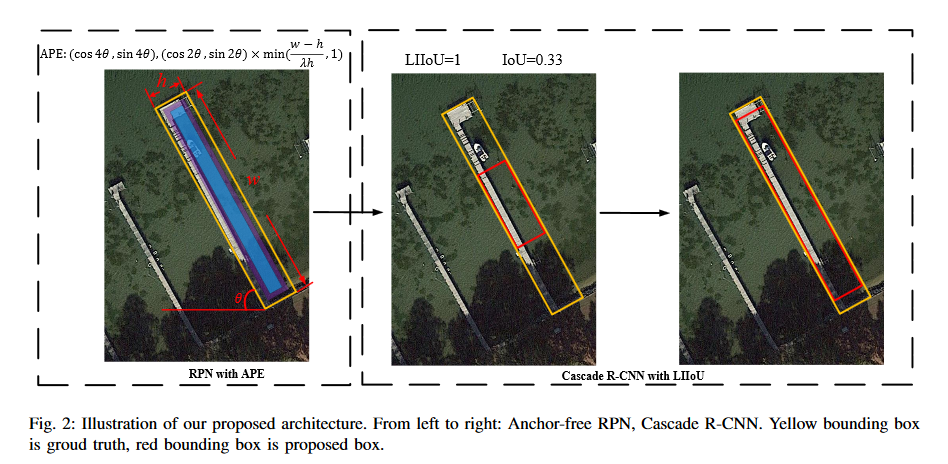

### Anchor-free label generation

RPN用于产生候选边框。之前大多数方法大都是基于anchor的。考虑到目标长宽比的巨大差异，采用anchor-free RPN。收缩的分割类标如图4所示，收缩方法与EAST相同。r1设置为0.1，r2设置为0.25.我们以r2的比例收缩边框，设置收缩的像素标记为正样本（蓝色区域）。接下来，我们以r1的比例收缩边框，设置收缩边框里的边缘像素（紫色）不为正样本（忽略），并设置loss权重为0。FPN输出多尺度特征图，我们获得不同层不同尺度下的目标。将那些短边h的目标分派到Pk层，k由下面的公式得到：

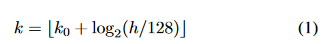

其中,k 是目标被分配到的层，k0是目标高度大于128小于256目标所分配到的层，k0被设置为4。由于不同尺度下的目标共享RPN的回归和分类参数，所以回归的目标应该归一化。有方向的边框被标记为

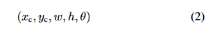

(xc,yc)是中心点的坐标，w,h分别是目标长边和短边的长度，theta是长边的角度。K层上的像素被标记为xk,yk.首先，用K层步长归一化目标边框，

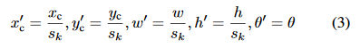

sk是k层上的步长，可由下面的式子进行计算：

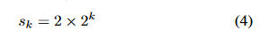

回归目标的参数可由下面的式子进行计算：

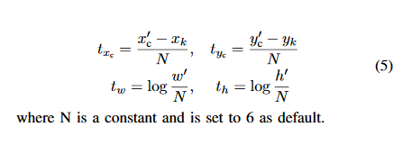

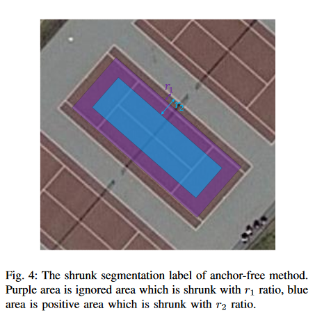

### Adaptive Period Embedding

水平边框可以很容易用四个向量表示，表示方向框时还需要另外一个参数theta表示。刚开始的挑战在于方向框的检测难以回归角度。theta的属性不同于其它的变量，因为theta是周期性变量。如图3所示，如果矩形的长度和宽度是相等的，那么这个矩形就是正方形，theta的周期就是90度。否则，theta的周期是180度。在神经网络中，一个变量不能表示一个周期属性的变量。尽管使用两维的周期变量表示角度，但依然不能满足向量的周期特性。因此提出一种可适应周期嵌入（APE）方法来表示角度。第一个向量的周期是90度，下面的公式为：

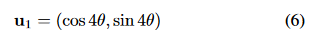

theta是矩形长边的角度。第二个向量的周期是180度，表示矩形的长边的角度，可由下面的公式表示：

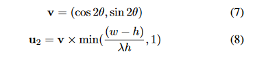

u1,u2在[-1,1]之间，所以我们使用sigmoid作激活函数，之后乘以2再减1.使用Smooth L1作为回归任务的激活函数：

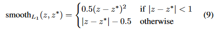

最后的输出是（x,y,w,h,u1,u2)。接下来，基于（u1,u2)计算矩形的角度。首先，

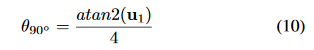

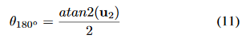

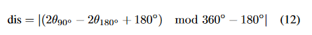

最后的theta计算：

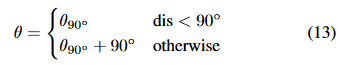

### Length Independent IoU

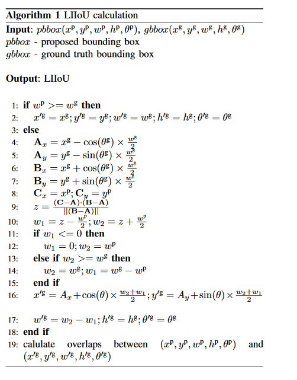

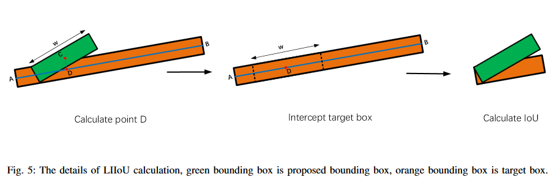

Cascade R-CNN

## Experiments

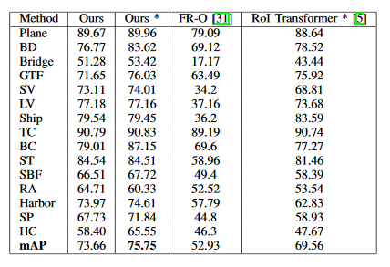

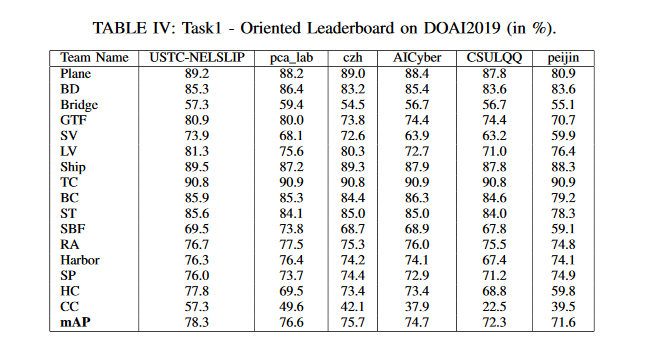