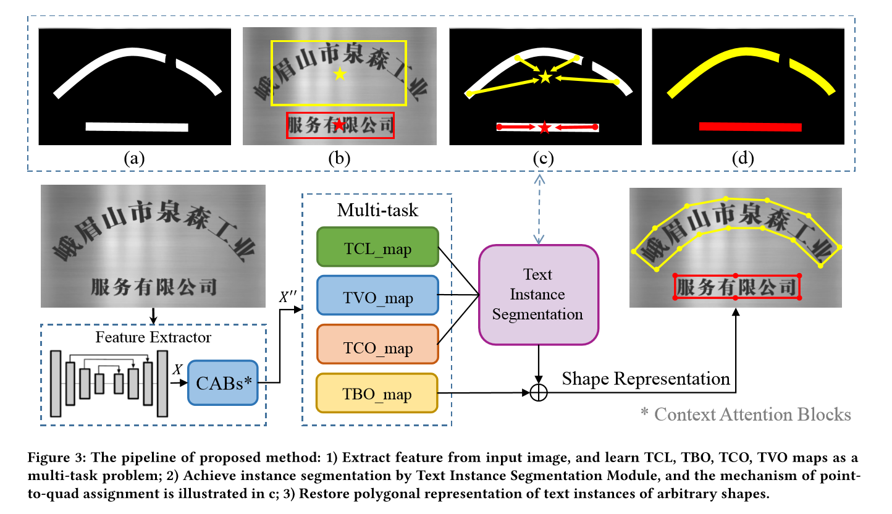

A Single-Shot Arbitrarily-Shaped Text Detector based on Context Attended Multi-Task Learning

基于场景多任务学习的任意形状文本检测算法

提出一种场景多任务学习的文本检测算法，其主要是基于全卷积神经网络学习几何属性用于重建文本区域的多边形表示

## Motivation

1. 考虑文本区域的特性，引入上下文注意机制模块用于获取像素信息间的长距离依赖，而获得一种可靠的分割结果
2. 后处理阶段，通过结合高层级的知识信息和低层级的像素信息，采用点到四点的分配方法用于聚类像素到某个文本实例
3. 任意形状的多边形区域可有效被几何属性表示

## Methodology

提取文本区域的中心线，并用使用回归的方法重建文本实例准确的形状

