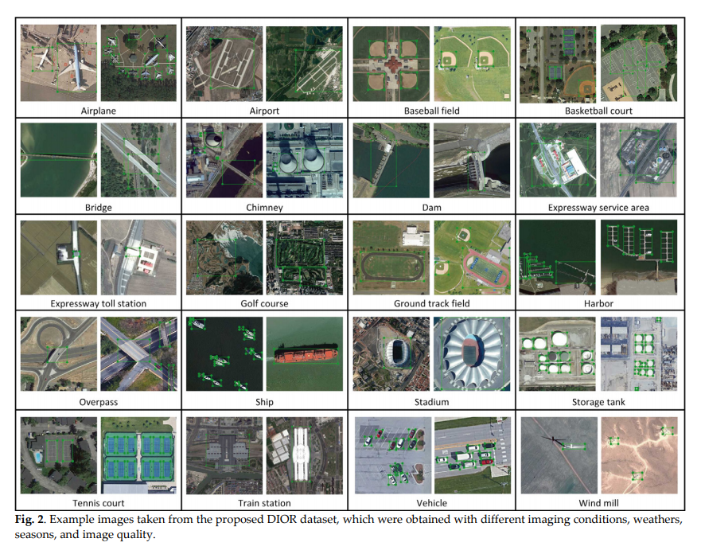

Object Detection in Optical Remote Sensing Images: A Survey
and A New Benchmark

光学遥感影像的目标检测

## 摘要

近年来，在光学遥感图像中提出各种目标检测方法方面进行了大量的工作。然而，目前对光学遥感图像中目标检测的数据集和基于深度学习的方法的研究还不够。此外，现有的数据集大多存在一些不足之处，如图像和目标类别数量少，图像多样性和变异性不足。这些局限性极大地影响了基于深度学习的目标检测方法的发展。本文综述了近年来基于深度学习的目标检测在计算机视觉和地球观测领域的研究进展。然后，我们提出了一个大规模、公开可用的光学遥感图像目标检测基准，我们称之为DIOR。数据集包含23463张图像和192472个实例，覆盖20个对象类。所提出的DIOR数据集1)在对象类别、对象实例数量和总图像数量上都是大规模的;2)对象大小变化范围大，不仅在空间分辨率方面，而且在跨对象的类间和类内大小变化方面;3)由于成像条件、天气、季节、成像质量的不同，成像结果差异较大;4)具有较高的类间相似性和类内多样性。提出的基准可以帮助研究人员开发和验证他们的数据驱动方法。最后，我们评估了DIOR数据集上的几种最先进的方法，以建立未来研究的基线。

## 1.引言

遥感技术的迅速发展，大大增加提升了遥感图像的数量和质量，可以用来表征地球表面的各种物体，如机场、飞机、建筑物等。这对通过自动分析和理解卫星或航空图像进行智能地球观测提出了强烈的要求。目标检测在图像判读中起着至关重要的作用，在智能监测、城市规划、精准农业、地理信息系统(GIS)更新等领域有着广泛的应用。在这一需求的驱动下，在过去的几年里，人们做出了巨大的努力来开发各种光学遥感图像中的目标检测方法(Aksoy, 2014;白等，2014;程等，2013a;程和韩，2016年;程等，2013b;Cheng等，2014;Cheng等人，2019年;Cheng等，2016a;Das等人，2011;Han et al.， 2015;Han et al.， 2014;李等人，2018;Long等，2017;Tang等，2017b;杨等，2017;张等，2016;张等，2017;周等，2016)。

最近，基于深度学习的算法已经主导了各种视觉识别任务的最高精度基准(Chen et al.， 2018;Cheng等，2018a;Clement等人，2013年;丁等，2017;Hinton等，2012;侯等，2017;Krizhevsky等，2012;Mikolov等，2012;田等人，2017;Tompson等人，2014;由于它们强大的特征表示能力。得益于此以及一些公开的自然图像数据集，如Microsoft Common Objects in Context (MSCOCO) (Lin et al.， 2014)和PASCAL Visual Object Classes (VOC) (Everingham et al.， 2010)，许多基于深度学习的对象检测方法在自然场景图像方面取得了巨大的成功(Agarwal et al.， 2018;Dai等，2016;Girshick, 2015;Girshick等人，2014;Han et al.， 2018;刘等，2018a;Liu等，2016a;Redmon等，2016;Redmon和Farhadi, 2017;Ren等人，2017)

014;Han et al.， 2018;刘等，2018a;Liu等，2016a;Redmon等，2016;Redmon和Farhadi, 2017;Ren等人，2017)。

然而，尽管在自然图像上取得了显著的成功，但将基于深度学习的目标检测方法直接应用于光学遥感图像上却存在一定的困难。我们知道，高质量和大规模的数据集对于训练基于深度学习的目标检测方法是非常重要的。然而，遥感图像与自然场景图像之间的差异是显著的。如图1所示，遥感图像通常捕捉地理空间对象的屋顶信息，而自然场景图像通常捕捉对象的轮廓信息。因此，从自然景物图像中学习到的目标探测器不容易应用到遥感图像中也就不足为奇了。尽管一些流行的对象检测数据集,如访问量VHR 10 (Cheng et al ., 2016), UCAS大气气溶胶(朱et al ., 2015), COWC (Mundhenk et al ., 2016),和队伍(夏et al ., 2018),提出了在地球观测社区,他们仍远未满足的需求深度学习算法。

(程和韩，2016;Cheng等，2016a;Das等人，2011;Han et al.， 2015;李等人，2018;Razakarivony和Jurie, 2015;Tang等，2017b;夏等，2018;横谷和岩崎，2015年;张等，2016;Zhu等人，2017)对遥感图像中的目标检测进行了研究。然而，目前关于数据集和基于深度学习的对象检测方法的文献综述还不够充分。此外，现有的公开数据集大多存在一些不足，如图像和对象类别数量少，图像多样性和变化也不够。这些局限性极大地阻碍了基于深度学习的目标检测方法的发展。

为了解决上述问题，我们尝试对基于深度学习的对象检测方法的最新进展进行全面的综述。然后，我们提出了一个大规模、公开可用的光学遥感图像目标检测基准，我们称之为DIOR。我们提出的数据集由20个对象类别覆盖的23463幅图像组成，每个类别包含约1200幅图像。在与其他现有对象检测数据集进行比较时，我们强调了迪奥数据集的四个关键特征。首先，总映像、对象类别和对象实例的数量是很大的。其次，对象的大小变化范围很大，不仅在空间分辨率方面，而且在跨对象的类间和类内大小变化方面也是如此。第三，我们的数据集有很大的变化，因为图像是在不同的成像条件、天气、季节和图像质量下获得的。四是具有较高的类间相似性和类内多样性。图2显示了一些来自我们所提议的DIOR数据集的示例图像及其注释。

主要贡献如下:1)基于深度学习的目标检测进展的综合综述。我们回顾了现有数据集和基于深度学习的目标检测方法在计算机视觉和地球观测领域的最新进展，包括110多篇论文。2)建立大规模的基准数据集。提出了一种大规模、公开可用的光学遥感图像目标检测数据集。据我们所知，所提议的DIOR数据集在对象类别数量和图像总数上都是最大的比例。该数据集使社区能够验证和开发数据驱动的对象检测方法。3)在所提议的DIOR数据集上进行性能基准测试。我们在我们的DIOR数据集上测试了几种具有代表性的基于深度学习的对象检测方法，以便为未来的研究工作提供一个艺术性能状态的概述。

本文的其余部分组织如下。第23节分别综述了计算机视觉和地球观测领域4个基准数据集和深度学习方法在目标检测方面的最新进展。第4节详细描述了所提议的DIOR数据集。第5节在提出的数据集上测试了几种典型的基于深度学习的对象检测方法。最后，第六部分对本文进行总结。

2.计算机视觉领域的目标检测研究进展

