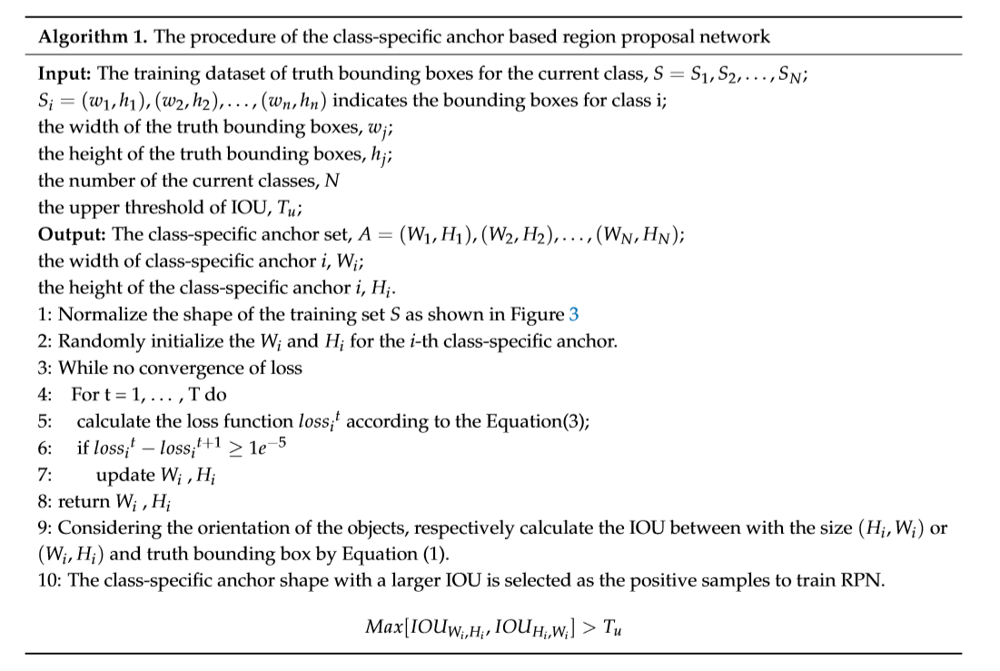
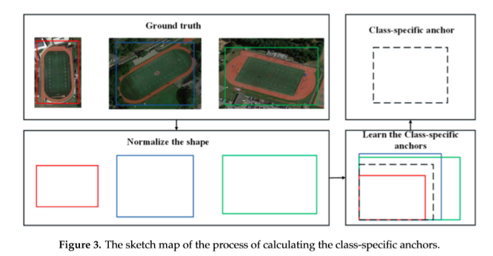
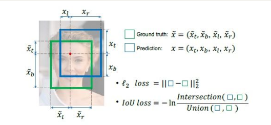
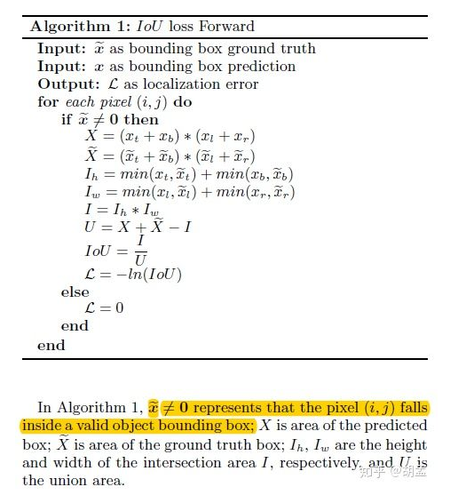
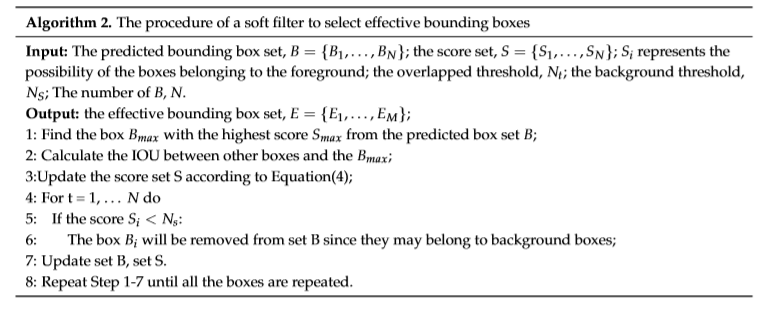
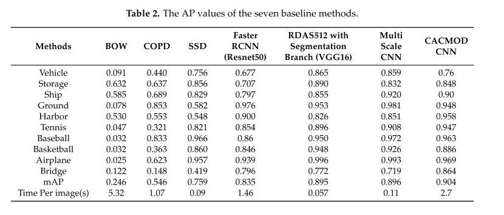
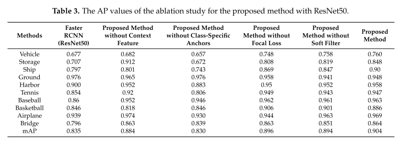

layout:     post
title:    Class-Specific Anchor Based and Context-Guided Multi-Class Object Detection in High Resolution Remote Sensing Imagery with a Convolutional Neural Network
subtitle:  基于特定类的锚框和上下文引导机制，使用卷积神经网络进行高分辨率遥感影像中的多目标检测
date:       2019-09-18
author:     BY E
catalog: true
tags:

    - Object Detection
    - Context-Guided
    - Remote Sensing Imagery

# Class-Specific Anchor Based and Context-Guided Multi-Class Object Detection in High Resolution Remote Sensing Imagery with a Convolutional Neural Network

[TOC]

## 基于特定类的锚框和上下文引导机制，使用卷积神经网络进行高分辨率遥感影像中的多目标检测

Intro:  2019 Remote Sensing

## Motivation

研究遥感影像中的多尺度目标检测问题

- 目标空间分布复杂多变，且尺度差异明显
- 对于小目标而言，提取到小目标类别特征信息有限
- NMS算法会删掉分数高的边框，导致丢掉一些边框结果
- 训练难易样本在分类过程中的平衡问题

## Method

文章提出基于特定类anchor和场景引导机制的卷积神经网络多目标检测方法。在Faster RCNN框架上进行改进提升。所提出的方法包含特定类的锚框的目标候选网络和一个包含上下文信息的判别特征分类网络。下面是网络模型图：

在RPN中，为了提升检测不同尺度目标的能力，设计了模块去学习特定类的anchors来产生边界框以覆盖不同尺度下的目标。在训练完RPN后，产生许多边界框。为了提升在分类阶段边界框的质量，采用软阈值的方法滤除未包含目标的边界框。

在分类阶段，考虑到在特征图中小目标中特定类的anchor有限的标注信息，结合原来的特征和上下文信息，来提升在识别目标过程中的判别能力。然而，对于分类器而言，还是难以区分难样本。因此采用了focal loss加强难样本的权重。

**自动学习特定类的锚框**

统计了数据集中每类目标的长宽像素

 IOU loss:

合并上下文信息以提升特征表达**

**更有效滤除预测框**

**Focal loss提升难样本的训练过程中的影响**

## Experiments

20% training dataset，20% validation dataset，60% testing dataset

Baseline Methods

## Q&&A

1、上下文信息融合是通过重复加强了特征的表达？

2、RPN中替换以往smooth l1回归损失函数策略，直接学习anchor的长宽，用IOU  loss策略 ，提供了anchor好的初始化，为什么没在后续检测阶段继续使用这样的回归损失函数策略？