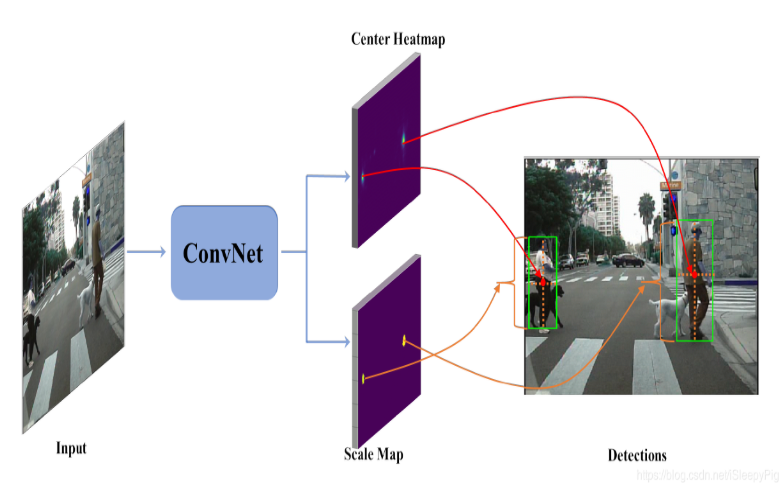
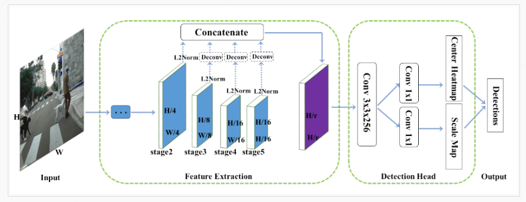
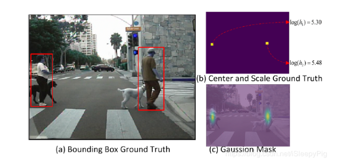

# High-level Semantic Feature Detection:A New Perspective for Pedestrian Detection

Intro: 2019 CVPR

Link：<https://arxiv.org/abs/1904.02948>		

Code: <https://github.com/liuwei16/CSP>

## 高层的语义特征检测：行人检测新思路

## Motivation

- 可实现无anchor形式的目标检测？
- 可实现语义特征点检测？
- 可同时实现预测目标中心点及其目标尺度？

基于以上动机，设计如下的行人检测框架图：

即在全卷积网络的基础上，构建一个目标中心点检测和目标尺度检测的任务。首先将一张图输入到网络中，基于网络提取的特征图再卷积式的预测两个映射图，一个以热图的方式呈现目标的中心位置，另一个负责预测目标的尺度大小。这样，便可将这两者映射到原图上解译成目标检测框：中心点对应检测框的中心位置，预测的尺度大小对应检测框的大小，中心点热图上的置信度对应检测框的得分。

## Method

CSP模型的整体框架：

- **特征提取模块**：以这样的特征融合方式进行：对C2-C5层特征图进行L2归一化，再利用反卷积将第3,4,5级的特征图分辨率提升到和第2级的特征图的分辨率保持一致，也就是原图的1/4，然后再将这些特征图在通道维度上进行拼接，得到融合后的特征图（紫色的特征图）。

- **检测头模块：**接着对融合后的特征图进行降维3x3的卷积层，再接上两个并联的1x1卷积层产生目标中心点热图和目标尺度预测图。由于采用降采样的特征图影响目标定位性能，特额外添加一个偏移预测分支，以进一步预测中心点到真实目标中心的偏移。

- **训练标记信息：**

  

  上图(a)展示了目标真实框的标注，(b)是中心点和尺度的生成示例，即当目标落在哪个位置，则对该位置赋值1（正样本），赋值尺度的log值（为将分布范围较大的原始尺度压缩在一定范围内，并且误差是尺度无关的，利于检测器的训练），其它位置赋值0（负样本）。(c)定义了一个高斯掩码，降低中心点周围负样本的权重（通过损失函数实现）。

  对于行人检测而言，采用人体中轴线标注，确定人的上顶点和下顶点并形成连线得到行人高度，然后采用固定的长宽比0.41直接确定行人宽度，进而生成目标包围框。因此，CSP只用预测目标高度，采用比值确定宽度，进而生成检测框。

  中心点偏移训练目标与尺度相似，卷积预测的通道包含两层，分别负责水平方向和垂直方向的偏移。

- **损失函数**

  中心点预测：二分类问题，即判断热图的每个位置是否是目标的中心点，是则为正样本。正样本周围存在大量负样本，为防止标注误差干扰，提出在每个正样本周围采用高斯掩码，以目标中心点为中心目标，水平/垂直方差与目标的宽度/高度成正比。若两个目标的高斯掩码之间存在重合，则选取两者中的最大值。采用Focal Loss对难样本赋予更大的权重。

## Questions and summaries

1. 拼接成的特征图大小？

   与stage2特征图大小一致

2. 反卷积与上采样的异同点？

   MaxPooling and Unpooling：

   MaxPooling and Upsampling:

   Convolution and Deconvolution:

3. 为什么尺度预测时，使用的log值是尺度无关的？

4. 高斯掩模是如何实现的？

   <https://www.zhihu.com/question/54918332/answer/142137732>

   掩模是一种矩阵

   本质上是二维空间中的坐标，分别是掩模内任一点的坐标，掩模中心的坐标。

   通过高斯公式计算每个掩模内的值，经归一化可得到高斯掩模。

   提取感兴趣区,用预先制作的感兴趣区掩模与待处理图像相乘,得到感兴趣区图像,感兴趣区内图像值保持不变,而区外图像值都为0

5. 如何进行中心点偏移的训练？

6. 热图与特征图的异同？

   热图是高维特征图，如FCN中最后一层所产生的特征图。

7. 若要实现多类目标的检测，会出现哪些问题以及如何进行改进？
