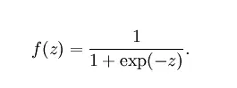
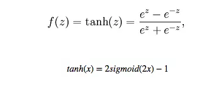
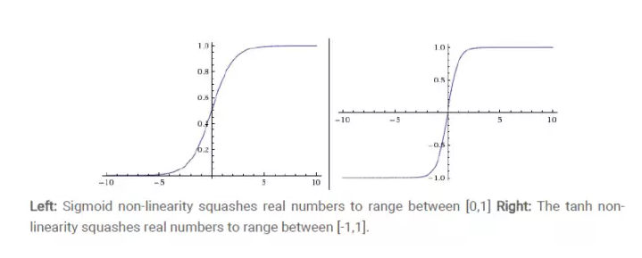
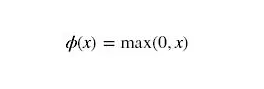
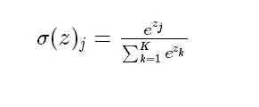
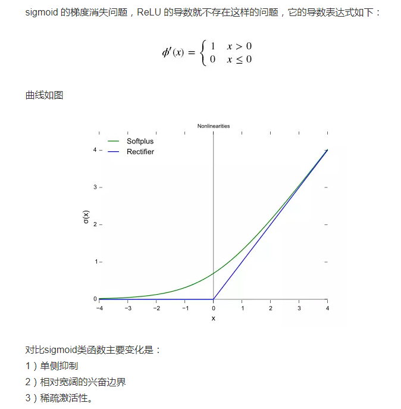

激活函数

为什么要用激活函数？

若不用激活函数，每一层输出都是上层输入的线性函数，无论神经网络多少层，输出都是输入的线性组合。

如果使用，激活函数给神经元引入了非线性因素，使得神经网络可任意逼非线性函数，这样神经网络可以应用到众多的非线性模型中。

激活函数的类别：

1. sigmoid函数

   

   f(z)取值范围为（0,1）,它可将一个实数映射到(0,1)区间，用来做二分类。

缺点：激活函数计算量大，反向传播求误差梯度时，求导涉及除法。

反向传播时，容易出现梯度消失情况，无法完成深层网络的训练。（导数从0开始又很快趋近于0，易造成“梯度消失”现象。

2. Tanh函数

Tanh是0均值的，因此tanh会比sigmoid更好。

3.Relu

缺点：训练很脆弱，容易die

一个非常大的梯度流过一个 ReLU 神经元，更新过参数之后，这个神经元再也不会对任何数据有激活现象了，那么这个神经元的梯度就永远都会是0

如果 learning rate 很大，那么很有可能网络中的 40% 的神经元都”dead”了

4.softmax函数

用于多分类神经网络的输出

如果使用 ReLU，要小心设置 learning rate，注意不要让网络出现很多 “dead” 神经元，如果不好解决，可以试试 Leaky ReLU、PReLU 或者 Maxout.

