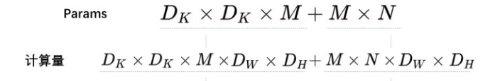

# mobileNet

2017年，谷歌提出MobileNetV1,它将VGG中的标准卷积层换成了深度可分离卷积

## 深度可分离卷积（更少的参数和更少的运算量）

可分离卷积有两种类型：空间可分离卷积核深度可分离卷积

空间可分离卷积：将一个大的卷积核变成了两个小的卷积核，比如将一个3*3的核分成一个3*1和一个1*3的核

深度可分离卷积：由深度卷积和逐点卷积组成

具体操作：将卷积核拆分成单通道的形式，在不改变输入特征图像的深度情况下，对每一通道进行卷积操作，这样就得到了和输入特征图通道数一致的输出特征图。逐点卷积是1*1，是对特征图进行升维和降维

